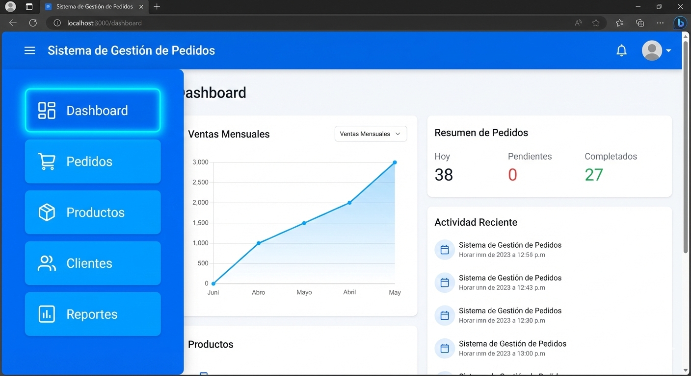

# Guía de Interfaz de Usuario

A continuación se muestra una captura de pantalla del panel principal:

{ width="600" }

> **Tip:** Puedes ver los botones de navegación resaltados en azul en la imagen superior.