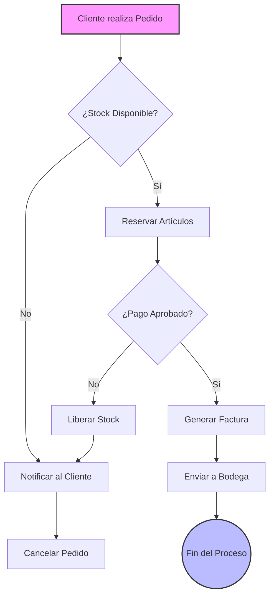

# Proceso de Aprobación de Pedidos

Este diagrama describe el flujo operativo desde que el cliente realiza un pedido hasta que sale de bodega.

```mermaid
graph TD
    A[Cliente realiza Pedido] --> B{¿Stock Disponible?}
    B -- No --> C[Notificar al Cliente]
    C --> D[Cancelar Pedido]
    B -- Sí --> E[Reservar Artículos]
    E --> F{¿Pago Aprobado?}
    F -- No --> G[Liberar Stock]
    G --> C
    F -- Sí --> H[Generar Factura]
    H --> I[Enviar a Bodega]
    I --> J((Fin del Proceso))
    
    style A fill:#f9f,stroke:#333,stroke-width:2px
    style J fill:#bbf,stroke:#333,stroke-width:2px
```