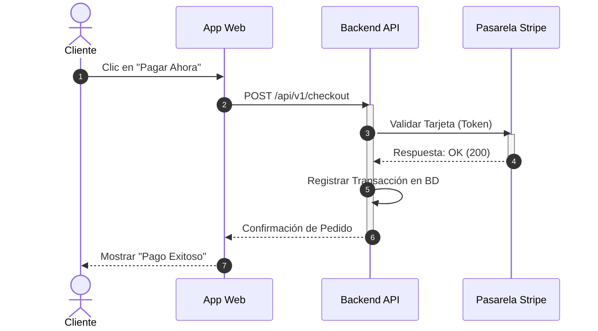

```markdown
# Secuencia de Transacción de Pagos

Interacción entre el Frontend (App Web), el Backend y la Pasarela de Pagos externa.
```


```mermaid
sequenceDiagram
    autonumber
    actor Cliente
    participant App as App Web
    participant API as Backend API
    participant Banco as Pasarela Stripe
    
    Cliente->>App: Clic en "Pagar Ahora"
    App->>API: POST /api/v1/checkout
    activate API
    API->>Banco: Validar Tarjeta (Token)
    activate Banco
    Banco-->>API: Respuesta: OK (200)
    deactivate Banco
    API->>API: Registrar Transacción en BD
    API-->>App: Confirmación de Pedido
    deactivate API
    App-->>Cliente: Mostrar "Pago Exitoso"
```